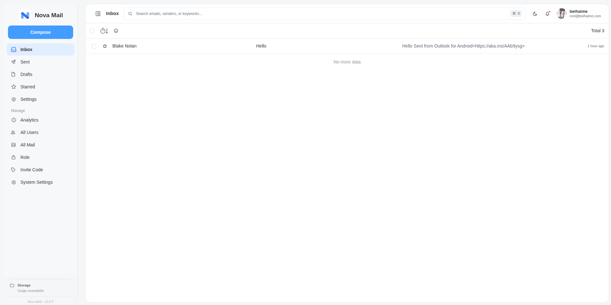

<div align="center">
  

  <h1>Nova Mail</h1>

  <p>
    <b>English</b> · <a href="README.zh-CN.md">简体中文</a>
  </p>

  <p>
    <a href="LICENSE">
      
    </a>
    <a href="https://github.com/beihaime/nova-mail/stargazers">
      
    </a>
    <a href="https://github.com/beihaime/nova-mail/network/members">
      
    </a>
    <a href="https://github.com/beihaime/nova-mail/issues">
      
    </a>
    <a href="https://github.com/beihaime/nova-mail/commits/main/">
      
    </a>
  </p>

  <p>
    <a href="https://vuejs.org/">
      
    </a>
    <a href="https://developers.cloudflare.com/workers/">
      
    </a>
    <a href="https://pnpm.io/">
      
    </a>
  </p>
</div>

Nova Mail is a modern web mail client based on the open-source [cloud-mail](https://github.com/maillab/cloud-mail) project. It keeps the original Cloudflare-based mail workflow while providing a cleaner interface, multi-address account management, and integrated OAuth authentication.

## Preview

### Login


### Mail interface



## Features

- Responsive desktop and mobile mail interface
- Light and dark themes with Nova Mail branding and PWA support
- Inbox, sent mail, drafts, starred mail, archive, spam, trash, folders, and search
- Multiple email addresses per Nova Mail account with address switching and a dedicated address-management page
- Compose, reply, forward, mark read/unread, star, delete, archive, attachments, and email printing
- Sanitized rich HTML email rendering and plain-text email support
- GitHub OAuth login and account linking
- Google OAuth/OIDC login and account linking
- Cloudflare Turnstile verification for protected account operations
- Admin user and mailbox management with roles and permissions
- Cloudflare Email Workers receiving, Resend sending/status webhooks, and R2 attachment storage
- Optional Telegram forwarding, webhook forwarding, verification-code extraction with Workers AI, and analytics
- English and Simplified Chinese localization

## Tech stack

### Frontend

- Vue 3 and Vite
- Vue Router and Pinia
- Element Plus
- Iconify and the Nova Mail SVG icon assets
- DOMPurify for email HTML sanitization
- `vite-plugin-pwa`

### Backend and infrastructure

- Cloudflare Workers with Hono
- Cloudflare D1 for application data
- Cloudflare KV for sessions, temporary OAuth grants, and cached settings
- Cloudflare R2 for attachments and stored objects
- Cloudflare Email Workers for inbound email handling
- Resend for outbound email and delivery webhooks
- Cloudflare Turnstile for bot verification
- Cloudflare Workers AI for optional verification-code extraction
- Drizzle ORM and Postal MIME

## Project structure

```text
nova-mail/
├── mail-vue/                  # Vue frontend
│   ├── src/components/        # Shared UI components
│   ├── src/layout/            # Application shell and header/sidebar
│   ├── src/router/            # Vue Router routes
│   ├── src/store/             # Pinia stores
│   ├── src/views/             # Mail, settings, login, preview, and admin views
│   ├── src/icons/             # Nova Mail SVG icon system
│   ├── public/                # Static assets and PWA icons
│   ├── package.json
│   └── vite.config.js
├── mail-worker/               # Cloudflare Worker backend
│   ├── src/api/               # HTTP API routes
│   ├── src/service/           # Authentication, mail, OAuth, storage, and settings logic
│   ├── src/entity/            # D1/Drizzle entities
│   ├── src/email/             # Cloudflare Email Worker handler
│   ├── src/security/          # Authentication and permission middleware
│   ├── src/hono/              # Hono application setup
│   ├── src/index.js           # Worker entry point
│   ├── wrangler.toml          # Production Worker configuration
│   ├── wrangler-dev.toml      # Local development configuration
│   └── package.json
├── doc/demo/                  # README screenshots
├── LICENSE
└── README.md
```

## Development

### Requirements

- Node.js 18 or newer
- pnpm
- A Cloudflare account for Worker/D1/KV development

The repository contains separate frontend and Worker packages. Install dependencies in each package:

```bash
git clone https://github.com/beihaime/nova-mail.git
cd nova-mail

pnpm --dir mail-vue install
pnpm --dir mail-worker install
```

Start the frontend development server:

```bash
pnpm --dir mail-vue dev
```

Start the Worker development environment in a second terminal:

```bash
pnpm --dir mail-worker dev
```

The frontend package also provides:

```bash
pnpm --dir mail-vue build    # production frontend build
pnpm --dir mail-vue preview  # preview the built frontend
```

The Worker package provides `dev`, `start`, `deploy`, and `test` scripts. The `test` script is the repository's Wrangler deployment configuration for the test environment; review `wrangler-test.toml` before using it.

## Configuration

Cloudflare bindings and non-secret variables are defined in `mail-worker/wrangler.toml` and its environment-specific variants. Common settings include:

- `domain`: allowed mail domains
- `admin`: administrator email address
- `TURNSTILE_HOSTNAME`: hostname expected by Turnstile verification
- `ai_model`: optional Workers AI model

Configure secrets with Wrangler. Never commit their values:

```bash
cd mail-worker
pnpm wrangler secret put jwt_secret
pnpm wrangler secret put TURNSTILE_SECRET_KEY
pnpm wrangler secret put GITHUB_CLIENT_SECRET
pnpm wrangler secret put GOOGLE_CLIENT_SECRET
pnpm wrangler secret put resend_webhook_secret
```

The corresponding public/provider configuration is managed through the existing settings flow and `GOOGLE_CLIENT_ID`/`GITHUB_CLIENT_ID` may be supplied as Worker environment variables where applicable. OAuth client secrets are server-side only.

### OAuth callback URLs

The Worker callback paths are:

```text
https://<your-domain>/api/oauth/github/callback
https://<your-domain>/api/oauth/google/callback
```

Register the exact deployed URLs in the GitHub and Google provider consoles. For the current deployment, the Google callback is:

```text
https://mail.beihaime.com/api/oauth/google/callback
```

Google login requests only the OpenID Connect identity scopes (`openid`, `email`, and `profile`). Nova Mail does not place provider access tokens in the browser or in the repository.

## Deployment

The production configuration uses a Cloudflare Worker with Static Assets. The frontend build output is written to the Worker asset directory configured in `mail-worker/wrangler.toml`.

Build and deploy from the Worker directory:

```bash
cd mail-worker
pnpm deploy
```

Before deploying by hand, review the selected Wrangler configuration, D1 and KV bindings, Static Assets directory, custom domain, and required secrets.

### GitHub Actions pipeline

`.github/workflows/deploy-cloudflare.yml` runs on every push to `main` that touches `mail-worker/**` or `mail-vue/**`, and can also be started manually (`workflow_dispatch`, or `gh workflow run deploy-cloudflare.yml`). It installs dependencies, renders `wrangler-action.toml` from repository secrets, builds the frontend, deploys the Worker, calls the initialization route and finally reads the database schema back to prove the migrations applied.

**A fork does not run workflows until they are enabled.** GitHub disables Actions in forked repositories, so the first step is to open the repository's **Actions** tab and click *"I understand my workflows, go ahead and enable them"*. Until that is done every push looks fine while nothing is deployed and no run is even recorded.

#### Repository secrets

Every value is read as `secrets.NAME || vars.NAME`, so repository **variables** work too — but put credentials in **Secrets**, because variable values are printed verbatim to the run log. All values must be a single line: the pipeline substitutes them into a TOML file with `sed`, and a wrapped paste breaks that step.

| Secret | Required | Value | If it is missing or wrong |
| --- | --- | --- | --- |
| `CLOUDFLARE_API_TOKEN` | yes | API token, see the permissions below | run fails in "Set up environment" |
| `CLOUDFLARE_ACCOUNT_ID` | yes | Cloudflare account ID | run fails in "Set up environment" |
| `JWT_SECRET` | yes | random, 32+ characters, no `?` `%` `#` `/` `\` `\|` `&` | signs login tokens; a new value signs every session out |
| `ADMIN` | yes | the administrator's **email address**, matching a real account | that account is treated as an ordinary user and gets no admin rights |
| `DOMAIN` | yes | a JSON array, e.g. `["example.com"]` | a bare `example.com` fails the `jq` validation and stops the run |
| `D1_DATABASE_ID` | yes¹ | `pnpm wrangler d1 list`, or `wrangler.toml` | without it the pipeline looks for a database named `$NAME` and **creates an empty one** |
| `KV_NAMESPACE_ID` | yes¹ | `pnpm wrangler kv namespace list` | without it a new KV namespace named `$NAME` is created and the cached counters are lost |
| `CUSTOM_DOMAIN` | no | e.g. `mail.example.com` | the `routes` block is dropped and the initialization call falls back to the `workers.dev` URL |
| `NAME` | no | defaults to `nova-mail` | must match the deployed Worker name |
| `AI_MODEL`, `ANALYSIS_CACHE`, `R2_BUCKET_NAME`, `PROJECT_LINK`, `CF_EMAIL` | no | see `wrangler-action.toml` | the R2 binding and `project_link` are removed when unset |

¹ Optional in the workflow, but leaving them out points the deployment at newly created, empty resources instead of the existing ones.

#### API token permissions

| Resource | Permission | Needed for |
| --- | --- | --- |
| Account | Workers Scripts · Edit | deploying the Worker |
| Account | Workers KV Storage · Edit | the KV binding |
| Account | D1 · Edit | the schema verification step; without it that step only warns |
| Zone | Workers Routes · Edit | the `custom_domain` route |
| Zone | Zone · Read | resolving that route |

The "Edit Cloudflare Workers" template covers both zone rows and the account rows except D1 — add D1 by hand.

#### Database initialization

Schema setup is versioned in `mail-worker/src/init/init.js` and applied by the Worker's own route:

```bash
curl -sL https://<your-domain>/api/init/<jwt_secret>   # answers: success
```

The pipeline calls this after every deploy. Two things are worth knowing:

- Each migration statement is wrapped in `try/catch`, so **`success` does not prove a migration applied** — a failed `ALTER TABLE` is only logged. That is why the pipeline reads the schema back and fails when a column is missing. The same check can be run by hand in the D1 console: `SELECT name FROM pragma_table_info('email');`
- The route is idempotent, so re-running it against an up-to-date database changes nothing. Never recreate or reset a production D1 database.

Individual migrations are also kept runnable on their own under `mail-worker/migrations/`, for when the `jwt_secret` is not at hand:

```bash
cd mail-worker
pnpm wrangler d1 execute <database-id> --remote --file migrations/v3_8_body_type.sql
```

#### Troubleshooting

| Symptom | Cause |
| --- | --- |
| The push succeeds, nothing is deployed, `gh run list` shows no runs | the fork's Actions were never enabled |
| `jq: parse error: Invalid numeric literal` / "DOMAIN must be a JSON array" | `DOMAIN` is not a JSON array |
| `sed: unterminated 's' command` | one of the substituted secrets contains a newline (a wrapped paste) |
| `Invalid TOML document ... admin = "..."` | `ADMIN` holds something that is not a plain email address |
| `Couldn't find DB with name ...` from `d1 execute` | the API token has no D1 permission, or the account ID is wrong |
| The deploy succeeds but the mail list is empty | the Worker ended up bound to a different, newly created D1 database |

Inbound mail is handled by the Worker Email handler, while outbound delivery and delivery-status events use the configured Resend integration. Attachments are authorized against the owning user before R2 objects are served.

## Upstream & credits

Nova Mail is based on [maillab/cloud-mail](https://github.com/maillab/cloud-mail). The upstream project and its original authors remain credited under the original license. Nova Mail adds its own branding and frontend, authentication, and security-related changes on top of that codebase.

## License

This project is licensed under the MIT License.

See [LICENSE](LICENSE) for details. The repository retains the original copyright notice and the Nova Mail modification copyright notice.
