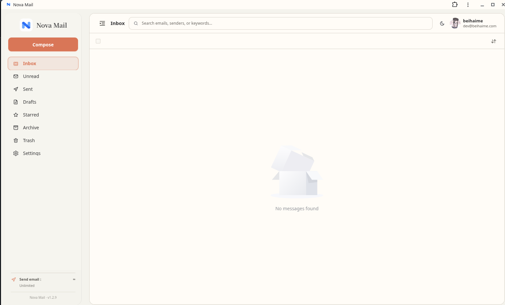

<div align="center">
  

  <h1>Nova Mail</h1>

  <p>
    <b>English</b> · <a href="README.zh-CN.md">简体中文</a>
  </p>

  <p>
    <a href="LICENSE">
      
    </a>
    <a href="https://github.com/beihaime/nova-mail/stargazers">
      
    </a>
    <a href="https://github.com/beihaime/nova-mail/network/members">
      
    </a>
    <a href="https://github.com/beihaime/nova-mail/issues">
      
    </a>
    <a href="https://github.com/beihaime/nova-mail/commits/main/">
      
    </a>
  </p>

  <p>
    <a href="https://vuejs.org/">
      
    </a>
    <a href="https://developers.cloudflare.com/workers/">
      
    </a>
    <a href="https://pnpm.io/">
      
    </a>
  </p>
</div>

Nova Mail is a self-hosted webmail application built on Cloudflare Workers. It combines a Vue 3 client with a Worker that receives mail through Cloudflare Email Routing, stores mailbox data in D1, and serves the application at the edge.

[Report an issue](https://github.com/beihaime/nova-mail/issues) · [MIT License](LICENSE)

## Preview




## Features

### Mail

- Conversation-based Inbox and reader, with quoted-reply collapsing and live reply updates.
- Inbox, Sent, Drafts, Starred, Archive, and Trash mailboxes; search, sorting, read/unread state, bulk actions, and undoable archive/trash/restore mutations.
- Compose, reply, reply-all, forward, CC/BCC, printing, attachments, and internal delivery between Nova Mail addresses.
- HTML, Markdown, and plain-text rendering; code blocks can show language, line numbers, syntax highlighting, and copy controls.
- Sender avatars resolved from local identities, BIMI, Gravatar, or a registrable sender domain when available.
- Inbound filtering, optional automatic cleanup, forwarding to email, Telegram, or a webhook, and optional Workers AI verification-code extraction.

### Experience

- Responsive desktop and mobile layouts, including configurable mobile swipe actions for archive or trash.
- Installable PWA with an adaptive theme colour and optional Web Push notifications.
- Light, dark, and system appearance modes; preset and editable light/dark colour palettes with import/export.
- Configurable compact or normal mail-list density, 12/24-hour times, notification sound, and English/Simplified Chinese UI.
- Desktop keyboard shortcuts for search, navigation, selection, composing, mailbox actions, and reading; press `?` in the app for the reference.

### Accounts and administration

- Multiple email addresses per account, address switching, and per-address receive controls.
- Password login plus GitHub, Google, and Linux DO OAuth login/account linking when those providers are configured.
- Device/session inventory, individual or other-session revocation, and optional login alerts by email or Telegram.
- Account deletion controls and role-based permissions.
- Administrator views for analytics, users and accounts, all mail, roles, invite codes, and system settings.

## Architecture

```text
Inbound email
  Cloudflare Email Routing
          |
          v
  Nova Mail Worker ── Postal MIME parsing ── D1 (users, mail, settings, sessions)
          |                                      |
          |                                      +── KV (session/cache/object fallback)
          +── R2 or S3 (optional attachments)    +── Web Push subscriptions
          +── Telegram / email forwarding / HTTPS webhook (optional)

Web client ── Vue 3 SPA served as Worker Static Assets ── Worker API

Outbound email ── Cloudflare Email Sending, or Resend per sending domain
Authentication ── password + optional GitHub / Google / Linux DO OAuth
```

The Worker also runs an hourly scheduled task for maintenance, counters, delayed receive completion, cleanup, OAuth cleanup, and analytics-cache refresh.

## Tech stack

| Area | Current implementation |
| --- | --- |
| Client | Vue 3, Vite, Vue Router, Pinia, Element Plus, Vue I18n |
| Mail UI | TinyMCE, DOMPurify, markdown-it, highlight.js, ECharts |
| Edge/API | Cloudflare Workers, Hono, Wrangler |
| Data | Cloudflare D1 with Drizzle ORM; Cloudflare KV |
| Object storage | Cloudflare R2 when bound, S3-compatible storage when configured, otherwise KV |
| Mail | Cloudflare Email Routing and Email Sending; Postal MIME; Resend |
| Identity and protection | JWT-backed server sessions, Turnstile, GitHub/Google/Linux DO OAuth, Web Push/VAPID |
| Optional processing | Cloudflare Workers AI, Telegram, outbound HTTPS webhooks |

## Deployment

### Prerequisites

- Node.js 20 or newer and pnpm 12 (the repository pins `pnpm@12.4.2`).
- A Cloudflare account with Workers, D1, and KV enabled.
- A verified Cloudflare zone if receiving mail or using a custom hostname.

Clone and install the workspace:

```bash
git clone https://github.com/beihaime/nova-mail.git
cd nova-mail
pnpm install
```

### 1. Create and bind Cloudflare resources

Create a D1 database and KV namespace, then copy their IDs into `mail-worker/wrangler.toml`. The binding names are part of the application contract and must remain `db` and `kv`.

```bash
cd mail-worker
pnpm wrangler d1 create nova-mail
pnpm wrangler kv namespace create nova-mail
```

In `wrangler.toml`, set `database_name`/`database_id` in `[[d1_databases]]` and the `id` in `[[kv_namespaces]]`. Configure the non-secret variables in `[vars]`:

```toml
[vars]
domain = ["example.com"]
admin = "admin@example.com"
TURNSTILE_HOSTNAME = "mail.example.com"
```

`domain` is an array of email domains Nova Mail may manage. `admin` must be an email address that will be created or used as the administrator. If deploying on a custom hostname, add the matching `[[routes]]` entry to the manual Wrangler configuration, or use the repository workflow's `CUSTOM_DOMAIN` input. The Worker can initially be deployed at its `workers.dev` URL.

R2 is optional: uncomment and populate the `r2` binding only when using an R2 bucket. Without R2 or S3 configuration, attachments use KV storage. The existing `[ai]` binding enables the optional Workers AI integration; leave `ai_model` unset unless verification-code extraction is enabled in System Settings.

### 2. Add Worker secrets

Use Worker secrets for credentials; do not put them in `[vars]`, the repository, or a client build. Run these from `mail-worker`:

```bash
pnpm wrangler secret put jwt_secret
pnpm wrangler secret put BOOTSTRAP_TOKEN
pnpm wrangler secret put TURNSTILE_SECRET_KEY
```

Generate independent random values for `jwt_secret` and `BOOTSTRAP_TOKEN`; the bootstrap token must be at least 32 characters and is only for a new database. Add feature-specific secrets only when enabling the associated feature.

### 3. Build, deploy, and initialize a new database

`wrangler.toml` builds the Vue application into `mail-worker/dist` during deployment:

```bash
pnpm deploy
```

Call the bootstrap endpoint exactly once against the deployed Worker URL. It applies the complete schema defined in `src/init/init.js` and atomically consumes the bootstrap token.

```bash
curl --fail-with-body -X POST https://<worker-or-custom-host>/api/bootstrap \
  -H "X-Bootstrap-Token: $BOOTSTRAP_TOKEN"
```

An initialized installation returns HTTP 409. Do not reset a production database to make this endpoint available; remove or rotate `BOOTSTRAP_TOKEN` after successful initialization.

### 4. Upgrade an existing database

New installations use bootstrap. Existing installations must apply only migrations that are not already present, before deploying code that depends on them. The currently shipped standalone migrations are in `mail-worker/migrations/`:

```bash
# Run from mail-worker. Substitute the actual D1 database ID or name.
pnpm wrangler d1 execute <D1_DATABASE> --remote --file migrations/v3_8_body_type.sql
pnpm wrangler d1 execute <D1_DATABASE> --remote --file migrations/v3_10_archived.sql
pnpm wrangler d1 execute <D1_DATABASE> --remote --file migrations/v3_11_trash.sql
pnpm wrangler d1 execute <D1_DATABASE> --remote --file migrations/v3_13_sessions.sql
pnpm wrangler d1 execute <D1_DATABASE> --remote --file migrations/v3_14_user_preferences.sql
```

Do not blindly rerun the v3.8, v3.10, or v3.11 files: SQLite has no `ADD COLUMN IF NOT EXISTS`. Inspect `pragma_table_info` first and apply only missing changes. The GitHub Actions deployment workflow performs guarded checks for the later mail, session, and preferences migrations when it has D1 write permission.

### 5. Configure email routing and sending

For inbound mail, verify the domain in Cloudflare, enable **Email Routing**, create the addresses or catch-all you intend Nova Mail to receive, and choose **Send to a Worker** with this Worker as the destination. The configured `domain` list and user address permissions must include the recipient domain.

For outbound mail, configure one of the following:

- Bind Cloudflare Email Sending as `email` in Wrangler to use Cloudflare's sending API.
- Or, in **Admin → System Settings**, add a Resend API token for each sender domain. External recipients require a configured sending provider; internal Nova Mail delivery does not.

Resend delivery-status webhooks are accepted at `/api/webhooks`; configure the webhook signing secret as the `resend_webhook_secret` Worker secret.

### 6. Configure optional sign-in and notifications

Register these exact OAuth callbacks with the provider, replacing the hostname:

```text
https://<host>/api/oauth/github/callback
https://<host>/api/oauth/google/callback
https://<host>/api/oauth/linuxdo/callback
```

GitHub uses `GITHUB_CLIENT_ID` and `GITHUB_CLIENT_SECRET` Worker bindings. Google can use `GOOGLE_CLIENT_ID` and `GOOGLE_CLIENT_SECRET` bindings or the administrator's Google OAuth settings. Enable the provider in System Settings as applicable. Google uses OpenID Connect scopes `openid`, `email`, and `profile`.

Turnstile verification requires `TURNSTILE_SECRET_KEY` and an accurate `TURNSTILE_HOSTNAME`. To enable Web Push, generate a VAPID key pair with the provided script:

```bash
node scripts/generate-vapid-keys.mjs
pnpm wrangler secret put vapid_public_key
pnpm wrangler secret put vapid_private_key
pnpm wrangler secret put vapid_subject
```

Telegram, S3-compatible object storage, forwarding, webhooks, blacklist rules, Resend tokens, and AI code extraction are configured by an administrator in **System Settings**. Webhook destinations are limited to HTTPS and the Worker rejects unsafe literal IP ranges and redirects; use an allowlist or controlled egress if DNS rebinding is a concern.

### GitHub Actions deployment

The included workflow tests before deploying. Its required deployment inputs are `CLOUDFLARE_API_TOKEN`, `CLOUDFLARE_ACCOUNT_ID`, `D1_DATABASE_ID`, `KV_NAMESPACE_ID`, `DOMAIN` (a JSON array), `ADMIN`, and `JWT_SECRET`. `BOOTSTRAP_TOKEN` is required only to initialize a new database. `CUSTOM_DOMAIN`, `R2_BUCKET_NAME`, `AI_MODEL`, `ANALYSIS_CACHE`, `PROJECT_LINK`, and VAPID values are optional. Enable Actions after forking the repository; otherwise pushes will not create deployment runs.

## Configuration reference

### Bindings and non-secret variables

| Name | Required | Purpose |
| --- | --- | --- |
| `db` | Yes | D1 database binding for application data |
| `kv` | Yes | KV binding for auth state, caches, and object-storage fallback |
| `assets` | Yes | Worker Static Assets binding serving `./dist` |
| `domain` | Yes | Array of managed email domains |
| `admin` | Yes | Administrator email address |
| `TURNSTILE_HOSTNAME` | Recommended | Allowed Turnstile/CORS hostname |
| `r2` | Optional | R2 attachment/object storage binding |
| `email` | Optional | Cloudflare Email Sending binding |
| `ai` / `ai_model` | Optional | Workers AI verification-code extraction |
| `analysis_cache` | Optional | Analytics-cache toggle |
| `CORS_ORIGIN`, `CORS_ORIGINS` | Optional | Additional API CORS origins |
| `project_link` | Optional | Project link exposed by settings |

### Secrets

| Secret | Required | Purpose |
| --- | --- | --- |
| `jwt_secret` | Yes | Signs authentication tokens |
| `BOOTSTRAP_TOKEN` | New database only | Single-use database bootstrap authorization |
| `TURNSTILE_SECRET_KEY` | When Turnstile is enabled | Server-side Turnstile verification |
| `GITHUB_CLIENT_ID`, `GITHUB_CLIENT_SECRET` | GitHub OAuth | GitHub OAuth client credentials |
| `GOOGLE_CLIENT_ID`, `GOOGLE_CLIENT_SECRET` | Google OAuth binding configuration | Google OAuth client credentials |
| `resend_webhook_secret` | Resend webhooks | Verifies Resend webhook signatures |
| `vapid_public_key`, `vapid_private_key`, `vapid_subject` | Web Push | VAPID subscription and delivery keys |

The Worker has no `RESEND_API_KEY` environment binding: Resend tokens are per-domain administrator settings. Likewise, Telegram and S3-compatible credentials are managed through protected system settings, not copied into this table.

## Security notes

Nova Mail includes the following current controls; they reduce specific risks and should be kept configured correctly rather than treated as a security guarantee.

- Authenticated API requests require a valid JWT, active server-side session, and KV-backed auth state. Sessions are stored hashed and can be revoked per device.
- Admin API prefixes require an administrator session; sensitive actions also use role permissions. Delegated roles cannot exceed the actor's permissions, domain scope, or relevant quotas.
- Mail and attachment identifiers are checked against the owner before access or mutation. Attachments are served through authenticated routes; direct `/attachments/` paths return 404.
- HTML mail is sanitized then rendered in a sandboxed iframe. Link/image handling is constrained, and attachment/message input has size, count, MIME, and filename validation.
- OAuth transactions use expiring, single-use state records, `__Host-` HttpOnly/Secure/SameSite cookies, PKCE, nonce validation, and short-lived browser-bound completion grants.
- Registration redemption is atomic; login and registration are rate limited. The bootstrap endpoint uses a constant-time token comparison and cannot initialize an existing application.
- Resend webhooks are signature-verified. Outbound webhook URLs are restricted to HTTPS, unsafe literal IP ranges are rejected, and redirects are not followed.
- API responses set browser security headers, and Turnstile verification validates the expected hostname when enabled.

Keep object storage private. Do not expose the attachments prefix through an R2 public domain, S3 bucket policy, or CDN rule.

## Development

From the repository root:

```bash
pnpm install
pnpm dev
```

Available root scripts are:

```bash
pnpm build
pnpm test
pnpm test:frontend
pnpm test:worker
pnpm test:worker:unit
pnpm test:worker:integration
```

`pnpm dev` starts Vite and `wrangler dev` for the two workspace packages. The Worker development command uses `mail-worker/wrangler-dev.toml`; set its D1/KV IDs and Worker secrets before testing authenticated flows. Worker integration tests use the isolated bindings in `wrangler.vitest.toml` and do not require Cloudflare credentials.

## Project structure

```text
nova-mail/
├── mail-vue/                 # Vue SPA, PWA assets, UI tests
│   ├── src/views/            # Mail, settings, login, and admin views
│   ├── src/components/       # Mail list, HTML frame, editor, avatars, shortcuts
│   └── public/               # PWA icons, push handler, static editor assets
├── mail-worker/              # Cloudflare Worker
│   ├── src/api/              # HTTP endpoints
│   ├── src/email/            # Cloudflare Email Routing handler
│   ├── src/service/          # Mail, auth, storage, OAuth, and integrations
│   ├── src/security/         # Session and authorization middleware
│   ├── migrations/           # Standalone upgrades for existing D1 databases
│   └── wrangler*.toml        # Production, development, test, and CI configs
├── doc/demo/                 # README screenshots
├── .github/workflows/        # Test-and-deploy workflow
└── README.md
```

## Contributing

Fork the repository, create a focused branch, make and test your change, then open a pull request describing the behaviour and verification. Please avoid committing credentials, generated local state, or production configuration values.

## License

Nova Mail is released under the [MIT License](LICENSE). The license retains copyright notices for the original project and Nova Mail modifications.

## Author

Beihaime — <https://github.com/beihaime>
