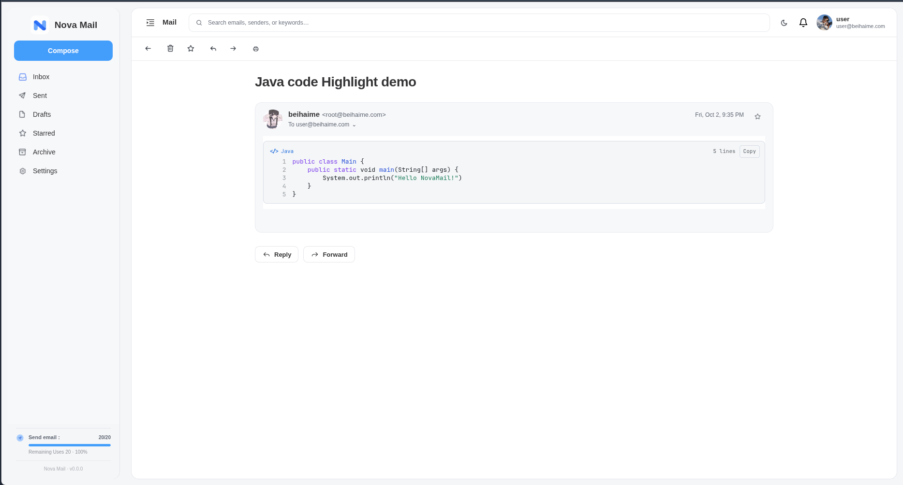

# 代码块与语法高亮

[English](CODE_HIGHLIGHTING.md)

Nova Mail 会将邮件中的代码显示为清晰、可复制的代码块，但不会修改邮件原始正文。阅读器先处理明确的代码标记；只有纯文本或纯文本结构的 HTML 才会使用保守的启发式识别。



## 阅读器效果

每个已识别代码块都提供：

- 优先使用 JetBrains Mono，并提供等宽字体回退；
- 语法高亮和代码语言标签；
- 紧凑、稳定的行号；
- 移动端横向滚动，绝不为了塞进屏幕而破坏缩进；
- Copy 按钮，复制原始源码而非带样式的 HTML；
- 自动适配 Light / Dark 主题的配色。

代码块不会形成可点击的操作抽屉，仍是邮件正文的一部分，也可以正常选择文本。

## 识别顺序

1. **Markdown 围栏代码**：例如 <code>```python</code>，直接采用声明的语言。
2. **HTML `<pre>` / `<code>`**：始终作为代码块渲染；邮件 HTML 会在增强前后都经过净化。
3. **以文本发送的 HTML 源码**：例如完整 `<!doctype html>` 文档，整体显示为一个 `HTML` 代码块，不会把 `<style>` 中的 CSS 错拆为单独代码块。
4. **纯文本与文本型 HTML**：按行扫描；常见邮件客户端用 `<div>` / `<br>` 表示的连续粘贴代码会先组合起来再判断。

启发式规则需要至少三行具有足够综合证据的代码特征，或两行高置信度特征。特征包括 import、声明、控制流、赋值、花括号、注释、明显缩进和常见命令。仅含冒号、括号或尖括号的一句普通文本不会被视为代码。

## 语言识别

围栏代码声明了语言时，该声明优先。没有声明时，Nova 只在出现足够明显的语言特征后才标记语言；无法可靠判断时，会安全显示为 `Plain text` 代码块。

| 阅读器显示语言 | 常见识别特征 |
| --- | --- |
| Python | `import`、`from … import`、`def`、`class`、`for … in` |
| Java | `package`、`public class`、`System.out` |
| JavaScript / TypeScript | `const`、`let`、`=>`、interface 或 type 声明 |
| C | `#include <stdio.h>`、`printf`、`int main` |
| C++ | `std::`、`namespace`、模板、`<vector>` / `<iostream>` |
| C# | `using`、`namespace`、`Console.` |
| Go | `package main`、`func`、`fmt.` |
| Rust | `fn`、`let mut`、`println!` |
| Shell | shebang、`export`、`echo`、`fi`、`done` |
| JSON | 合法 JSON |
| HTML | 文档开头和结构性 HTML 标签 |
| CSS | 选择器 / 属性结构 |
| SQL | `SELECT`、`INSERT`、`UPDATE`、`DELETE`、`CREATE TABLE` |

`#include <stdio.h>` 会明确识别为 C，而不是 HTML。Java 与 C# 会在 C++ 之前判断，因此 Java 的 `public class` 不会被宽泛的 C++ `class` 规则抢走。

## 示例

### 纯文本 Python

```text
import time

target = 700_000_000
for i in range(1_000_000_000):
    if i == target:
        break

print(f"found: {i}")
```

即使没有 Markdown 围栏，也会识别为一个 Python 代码块。

### HTML 源码文本

```html
<!doctype html>
<html lang="en">
  <head><style>body { color: #18181b; }</style></head>
  <body><main>Hello</main></body>
</html>
```

整个文档会显示为一个 HTML 代码块。该规则面向“作为文本发送的源码”；真正的 `text/html` 邮件仍会被净化后按邮件内容渲染。

### C 与 C++

```c
#include <stdio.h>

int main(void) {
  printf("Hello, Nova Mail!\n");
  return 0;
}
```

```cpp
#include <vector>

int main() {
  std::vector<int> values{1, 2, 3};
}
```

## 安全与隐私

代码增强不会绕过邮件 HTML sanitizer。HTML 邮件先净化后再做代码识别，生成的高亮 HTML 会再次净化，并且只放行 Nova 自己生成的 Copy 控件。复制源保存在转义后的原始文本中；不会执行代码，也不信任邮件带来的 class、style、script 或事件属性。

普通 HTML 邮件的远程图片仍默认拦截，需由读者主动允许。语法高亮不会改动引用回复、签名或附件区域。

## 验证

前端测试覆盖 Markdown / HTML 显式代码、Python、Java、JavaScript、Shell、C/C++、HTML 源码、普通中英文正文，以及带括号的短句。运行：

```bash
pnpm --filter mail-vue run test
pnpm --filter mail-vue run build
```
